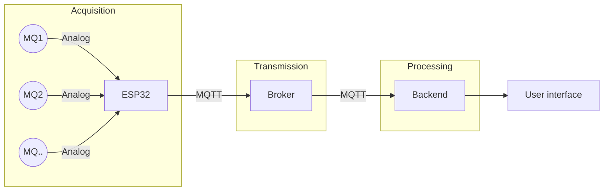

<h1 align="center">Odor localization</h1>

# 📝 Description

TODO

## Architecture

```mermaid
graph LR
    
    subgraph "Acquisition"
        MQ1((MQ1)) -->|Analog| ESP32
        MQ2((MQ2)) -->|Analog| ESP32
        MQ..((MQ..)) -->|Analog| ESP32
    end
    
    subgraph "Transmission"
        Broker[Broker]
        ESP32 -->|MQTT| Broker
    end    

    subgraph "Processing"
        Backend[Backend]
        Broker -->|MQTT| Backend
    end

    UI[User interface]

    Backend --> UI
```
